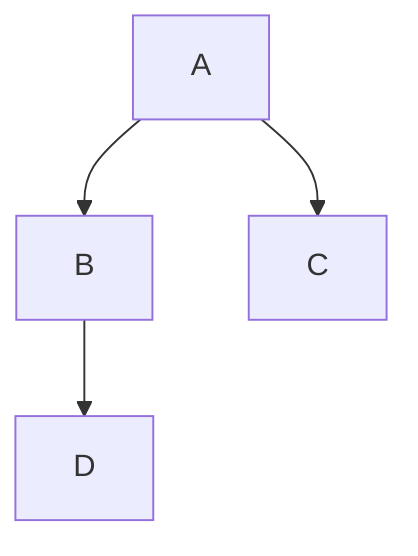

# CLAUDE.md

This file provides guidance to Claude Code (claude.ai/code) when working with code in this repository.

## Repository Overview

This is the Netdata Learn documentation site - a Docusaurus-based documentation platform that serves as the central knowledge base for all Netdata products. It automatically ingests documentation from multiple repositories and presents it in a unified, searchable interface.

## Technology Stack

- **Framework**: Docusaurus 3.7.0
- **Styling**: Tailwind CSS with custom configuration
- **Content**: MDX (Markdown + JSX components)
- **Analytics**: PostHog, Google Analytics, Google Tag Manager
- **Deployment**: Netlify
- **Build Tools**: Yarn, Node.js 22.14.0

## Development Commands

### Setup and Development

```bash
# Install dependencies
yarn install

# Start development server
yarn start
# Opens at http://localhost:3000

# Clear cache (useful for sidebar issues)
yarn clear
```

### Building

```bash
# Production build
yarn build

# Serve production build locally
yarn serve

# Type checking
yarn typecheck
```

### Content Ingestion

```bash
# Run the Python ingestion script
cd ingest
python ingest.py

# Or use the legacy JavaScript version
node ingest.js
```

## Project Structure

```
learn/
├── docs/                    # Documentation content (MDX files)
│   ├── alerts-&-notifications/
│   ├── collecting-metrics/
│   ├── dashboards-and-charts/
│   ├── deployment-guides/
│   ├── developer-and-contributor-corner/
│   ├── netdata-agent/
│   ├── netdata-cloud/
│   └── ...
├── src/                    # React components and customizations
│   ├── components/         # Custom components
│   ├── css/               # Global styles
│   ├── pages/             # Custom pages
│   └── theme/             # Theme overrides
├── static/                # Static assets
│   ├── img/
│   └── data/
├── ingest/                # Content ingestion system
│   ├── ingest.py          # Main ingestion script
│   └── config/            # Repository configurations
├── docusaurus.config.js   # Main configuration
├── sidebars.js           # Sidebar configuration
└── map.tsv               # Content mapping file
```

## Content Management

### Documentation Structure

Each MDX file should have frontmatter:
```mdx
---
title: "Page Title"
description: "Page description"
custom_edit_url: "https://github.com/netdata/netdata/edit/master/path/to/file.md"
sidebar_label: "Sidebar Label"
learn_status: "Published"
learn_rel_path: "Category/Subcategory"
sidebar_position: 100
---

# Content starts here
```

### Content Ingestion System

The repository pulls documentation from multiple sources:

1. **Source Repositories**:
   - `netdata/netdata` - Main agent documentation
   - `netdata/.github` - Community guidelines
   - `netdata/agent-service-discovery` - Discovery documentation
   - `netdata/netdata-grafana-datasource-plugin` - Grafana plugin docs
   - `netdata/helmchart` - Helm chart documentation
   - `netdata/netdata-cloud-onprem` - On-premise documentation

2. **Mapping System** (`map.tsv`):
   ```
   source_file	dest_file	source_repo	sidebar_position	learn_status
   docs/foo.md	collecting-metrics/foo.md	netdata/netdata	100	Published
   ```

3. **Automated Updates**:
   - GitHub Actions runs ingestion every 3 hours
   - Creates PRs with updates
   - Maintains checksums for verification

### Adding New Documentation

1. **For existing repos**: Update `map.tsv` with mapping
2. **For new content**: Add MDX files directly to `docs/`
3. **For external repos**: Configure in `ingest/config/`

## Styling and Components

### Tailwind CSS

Custom configuration in `tailwind.config.js`:
```javascript
// Use Tailwind classes in MDX
<div className="bg-blue-100 p-4 rounded-lg">
  Custom styled content
</div>
```

### Custom Components

Available in MDX files:
```mdx
import Tabs from '@theme/Tabs';
import TabItem from '@theme/TabItem';

<Tabs>
  <TabItem value="linux" label="Linux">
    Linux content
  </TabItem>
  <TabItem value="docker" label="Docker">
    Docker content
  </TabItem>
</Tabs>
```

### Mermaid Diagrams

```mdx

```

## Configuration

### Docusaurus Config

Key settings in `docusaurus.config.js`:
- Site metadata
- Theme configuration
- Plugin settings
- Navigation setup
- Footer links

### Environment Variables

Required for builds:
- `POSTHOG_APP_ID` - PostHog analytics
- `GTM_ID` - Google Tag Manager
- `GA_ID` - Google Analytics

## Deployment

### Netlify Configuration

Defined in `netlify.toml`:
- Build command: `yarn build`
- Publish directory: `build`
- Node version: 22.14.0
- Extensive redirect rules

### Branch Deployments

- `master` → Production (learn.netdata.cloud)
- Feature branches → Preview deployments

## Common Tasks

### Adding a New Category

1. Create folder in `docs/`
2. Add `_category_.json`:
```json
{
  "label": "Category Name",
  "position": 1,
  "link": {
    "type": "generated-index",
    "description": "Category description"
  }
}
```

### Updating from Source Repos

```bash
# Manual update
cd ingest
python ingest.py

# Check specific repository
python ingest.py --repo netdata/netdata
```

### Debugging Build Issues

```bash
# Clear all caches
yarn clear
rm -rf .docusaurus
rm -rf build
rm -rf node_modules/.cache

# Rebuild
yarn install
yarn build
```

### Search Configuration

Search is handled by Docusaurus's built-in search. To improve search:
1. Use clear page titles
2. Add search keywords in frontmatter
3. Structure content with proper headings

## Best Practices

1. **MDX Files**: Keep them focused on single topics
2. **Images**: Store in `static/img/` and reference with `/img/`
3. **Links**: Use relative links for internal navigation
4. **Code Blocks**: Specify language for syntax highlighting
5. **Versioning**: Documentation isn't versioned - always shows latest

## Important Notes

1. **Automated Content**: Most documentation comes from other repos - edit at source
2. **Build Times**: Large site, builds can take several minutes
3. **Preview Deployments**: Every PR gets a preview URL
4. **SEO**: Frontmatter affects SEO - fill it completely
5. **Analytics**: PostHog tracks page views and user journey