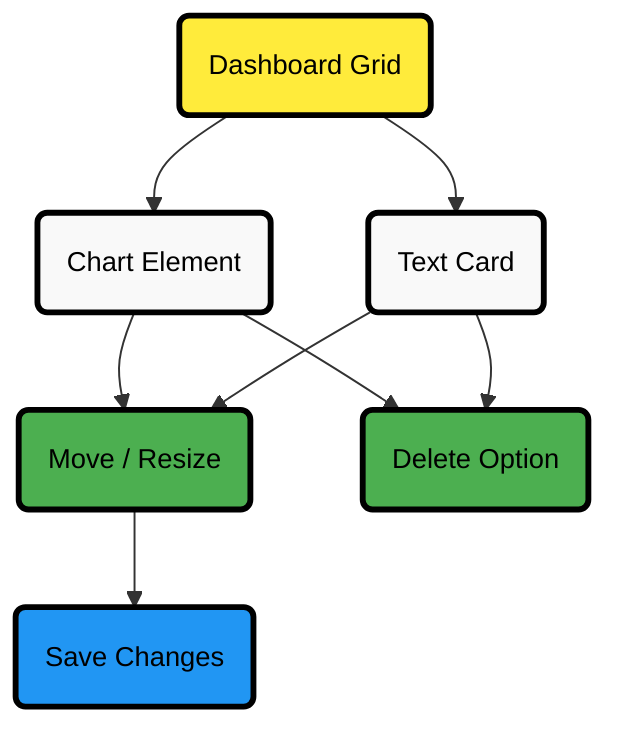

# Dashboards Tab

With **Netdata Cloud**, you can build **custom dashboards** that target your infrastructure's unique needs. Dashboards help you centralize key metrics from any number of distributed systems, offering a clear, interactive overview of your infrastructure.

Click the **Dashboards** tab in any Room to get started.

## Create Your First Dashboard

To create a new dashboard:

1. From the **Dashboards** tab, click the **+** button.
2. In the modal, enter a name for your dashboard and click **+ Add**.

You can now add elements to your dashboard:

### Add a Chart

Click the **Add Chart** button at the top right of the dashboard.

| Step                     | Action                                                                                                                                                                                                                                                                                       |
|--------------------------|----------------------------------------------------------------------------------------------------------------------------------------------------------------------------------------------------------------------------------------------------------------------------------------------|
| **Select Source**        | Choose **All Nodes** or a specific node.                                                                                                                                                                                                                                                     |
| **Choose Context**       | Select the metric context. A preview of the chart will appear.                                                                                                                                                                                                                               |
| **Configure Chart**      | Adjust settings using the [NIDL framework](/docs/dashboards-and-charts/charts#nidl-framework):   - Group by method   - Aggregation function over the data source   - Nodes   - Instances   - Dimensions   - Labels   - Aggregation function over time |
| **Chart Type**           | Change the chart type using the [Title bar](/docs/dashboards-and-charts/charts#title-bar).                                                                                                                                                                                        |
| **Dimension Visibility** | Select which dimensions to display and set their order via the [Dimensions bar](/docs/dashboards-and-charts/charts#dimensions-bar).                                                                                                                                               |

### Add Text Cards

Click the **Add Text** button at the top right to add a text card.

Use text cards to:

- Document the purpose of the dashboard.
- Add notes for your team members.

:::tip

Click the **T** icon in the text box to switch between font sizes.

:::

:::important

Always click the **Save** button after making changes to your dashboard.

:::

## Dashboard Layout Overview

:::tip

The diagram above shows how charts and text cards interact within the dashboard layout. Use **drag & drop to move elements and resize** them as needed. Save your layout to keep changes. Remove elements using the delete option.

:::

:::tip

Keep related charts close together to improve visual correlation between metrics.

:::

## Using Your Dashboard

Dashboards are interactive and flexible. You can design them to fit your needs using any combination of charts and text cards.

### Chart Interaction

Charts on custom dashboards are [fully interactive](/docs/dashboards-and-charts/charts):

- Zoom, pan, and highlight timeframes.
- Synchronize charts across contexts and nodes.

### Text Cards

Text cards allow you to explain the arrangement or intent behind the dashboard. Share insights with your team directly on the dashboard.

## Organizing Dashboard Elements

### Move Elements

| Action                   | How to Do It                                                                                    |
|--------------------------|-------------------------------------------------------------------------------------------------|
| **Move a chart or card** | Click and hold **Drag & drop** at the top right of the element, then move it to a new location. |
| **Resize an element**    | Click and drag from the bottom-right corner of the element.                                     |

:::tip

Elements automatically align to the grid system after moving or resizing.

:::

## Chart Management Actions

| Action                     | How to Perform                                                                                                                                                                                              |
|----------------------------|-------------------------------------------------------------------------------------------------------------------------------------------------------------------------------------------------------------|
| **Go to chart**            | Use the 3-dot icon on any chart → click **Go-to-Chart**. Navigate directly to the chart in the [Metrics tab](/docs/dashboards-and-charts/tabs/metrics) or the single-node dashboard. |
| **Rename a chart**         | Use the 3-dot icon on any chart → click **Rename**.                                                                                                                                                         |
| **Remove a chart or card** | Use the 3-dot icon on the element → click **Remove**.                                                                                                                                                       |

## Managing Your Dashboard

| Action                 | How to Perform                                                  |
|------------------------|-----------------------------------------------------------------|
| **View dashboards**    | Click the **Dashboards** tab in any Room.                       |
| **Delete a dashboard** | Select the dashboard → click the 🗑️ icon or **Delete** button. |
| **Save changes**       | Click the **Save** button after making any edits.               |

:::note

If multiple users edit the same dashboard at once, the second user who clicks **Save** will be prompted to either overwrite or reload the dashboard to see the latest changes.

:::

## TV Mode

**TV Mode** generates shareable, token-authenticated URLs for displaying dashboards on large screens without requiring a login. This is ideal for displaying critical metrics on TVs, wallboards, or shared monitors in operations centers and team spaces.

### How to Use TV Mode

1. Open the dashboard you want to display.
2. Click the **TV Mode** button in the dashboard action bar (located next to the **Save** button).
3. A modal will appear with a generated URL that includes an embedded access token and preserves your current time range settings.
4. Copy the URL and open it in a browser on your display device.

### How It Works

When you generate a TV Mode URL:

- **Automatic Token Creation**: Netdata Cloud automatically creates an API token with full scope (`scope:all`) for authentication.
- **Embedded Authentication**: The generated URL includes the access token, allowing the dashboard to load without requiring a login.
- **Time Range Preservation**: The URL captures your current time range settings, so viewers see the same data timeframe you selected.
- **Optimized Display**: The dashboard renders in a TV-optimized display mode for large screens.

### Use Cases

TV Mode is perfect for:

- **Network Operations Centers (NOCs)**: Display critical infrastructure metrics on large screens for 24/7 monitoring.
- **Operations Centers**: Keep teams informed with real-time system health and performance dashboards.
- **Team Spaces**: Share dashboards on shared screens or wallboards for collaborative monitoring.
- **Wallboard-Style Monitoring**: Create persistent displays for continuous metric visibility.

### Security Considerations

:::warning

TV Mode URLs contain unique access tokens that provide full access to your Netdata Cloud dashboards and are embedded directly in the URL. Treat these URLs like secrets and **share them only with trusted users**.

:::

- **Token Security**: Anyone with the TV Mode URL can access the dashboard without authentication.
- **Token Management**: TV Mode tokens can be viewed and revoked in **User Settings > API Tokens**. Learn more in the [API Tokens documentation](/docs/netdata-cloud/authentication-&-authorization/api-tokens).
- **Safe Handling**: Because the access token is in the URL, it can appear in browser history, logs, screenshots, clipboard managers, or HTTP Referer headers. Avoid posting TV Mode URLs in tickets, chats, or other shared channels, and revoke the token immediately if the URL is exposed.
- **Revocation & Lifecycle**: TV Mode tokens do not expire automatically; manage their lifecycle by revoking tokens when they're no longer needed.

## Minimum Browser Viewport Requirement

Due to the visual complexity of individual charts, dashboards require a **minimum browser viewport width of 800px**.

## Next Steps

After designing your dashboards, [invite your team](/docs/netdata-cloud/spaces-and-rooms#set-up-team-access) to collaborate. Add new users to the same Room so they can view and interact with your dashboards effortlessly.
