# Netdata Cloud On-Prem

Cloud On-Prem brings powerful monitoring and visualization features directly to your infrastructure. **Netdata Cloud On-Prem enables you to deploy the complete control plane within your own environment**.

This solution is built for organizations that require **enhanced data privacy**, **strict compliance adherence**, and **complete infrastructure control**. Whether you're managing critical infrastructure, operating under stringent regulations like GDPR or HIPAA, or simply need the flexibility to customize your monitoring environment, Netdata Cloud On-Prem delivers enterprise-grade observability without compromising on security or control.

:::note

A license key is required to activate the On-Prem components, and it is provided **only after** Sales Qualification.
To run a proof of concept (POC) of Netdata On-Prem, please contact our team first using [this form](https://www.netdata.cloud/request-enterprise/).

:::

<strong>The overall architecture diagram</strong>
 

```mermaid
flowchart TD
    Agents("**🌍 Netdata Agents**<br/><br/>Users' infrastructure<br/><br/>Netdata Children & Parents")
    users("**🔥 Unified Dashboards**<br/><br/>Integrated Infrastructure<br/><br/>Dashboards")
    ingress("**🛡️ Ingress Gateway**<br/><br/>TLS termination")
    traefik("**🔒 Traefik**<br/><br/>Authentication &<br/><br/>Authorization")
    emqx("**📤 EMQX**<br/><br/>Agents Communication<br/><br/>Message Bus<br/><br/>MQTT")
    pulsar("**⚡ Pulsar**<br/><br/>Internal Microservices<br/><br/>Message Bus")
    frontend("**🌐 Front-End**<br/><br/>Static Web Files")
    auth("**👨‍💼 Users & Agents**<br/><br/>Authorization<br/><br/>Microservices")
    spaceroom("**🏡 Spaces, Rooms,<br/><br/>Nodes, Settings**<br/><br/>Microservices for<br/><br/>managing Spaces,<br/><br/>Rooms, Nodes and<br/><br/>related settings")
    charts("**📈 Metrics & Queries**<br/><br/>Microservices for<br/><br/>dispatching queries<br/><br/>to Netdata Agents")
    alerts("**🔔 Alerts & Notifications**<br/><br/>Microservices for<br/><br/>tracking alert<br/><br/>transitions and<br/><br/>deduplicating alerts")
    sql("**✨ PostgreSQL**<br/><br/>Users, Spaces, Rooms,<br/><br/>Agents, Nodes, Metric<br/><br/>Names, Metrics Retention,<br/><br/>Custom Dashboards,<br/><br/>Settings")
    redis("**🗒️ Redis**<br/><br/>Caches needed<br/><br/>by Microservices")
    elk("**🗞️ Elasticsearch**<br/><br/>Feed Events Database")
    bridges("**🤝 Input & Output**<br/><br/>Microservices bridging<br/><br/>agents to internal<br/><br/>components")
    notifications("**📢 Notifications Integrations**<br/><br/>Dispatch alert<br/><br/>notifications to<br/><br/>3rd party services")
    feed("**📝 Feed & Events**<br/><br/>Microservices for<br/><br/>managing events feed")

    users --> ingress
    Agents --> ingress
    ingress --> traefik
    ingress ==>|**agents<br/><br/>websockets**| emqx
    traefik -.- auth
    traefik ==>|**http**| spaceroom
    traefik ==>|**http**| frontend
    traefik ==>|**http**| charts
    traefik ==>|**http**| alerts
    spaceroom o-...-o pulsar
    spaceroom -.- redis
    spaceroom x-..-x sql
    spaceroom -.-> feed
    charts o-.-o pulsar
    charts -.- redis
    charts x-.-x sql
    charts -..-> feed
    alerts o-.-o pulsar
    alerts -.- redis
    alerts x-.-x sql
    alerts -..-> feed
    auth o-.-o pulsar
    auth -.- redis
    auth x-.-x sql
    auth -.-> feed
    feed <--> elk
    alerts ----> notifications
    emqx <.-> bridges o-..-o pulsar

    %% Style definitions
    classDef alert fill:#ffeb3b,stroke:#000000,stroke-width:3px,color:#000000,font-size:18px
    classDef neutral fill:#f9f9f9,stroke:#000000,stroke-width:3px,color:#000000,font-size:18px
    classDef complete fill:#4caf50,stroke:#000000,stroke-width:3px,color:#000000,font-size:18px
    classDef database fill:#2196F3,stroke:#000000,stroke-width:3px,color:#000000,font-size:18px

    %% Apply styles
    class Agents,users alert
    class ingress,traefik,emqx,pulsar,frontend neutral
    class auth,spaceroom,charts,alerts,bridges,notifications,feed complete
    class sql,redis,elk database
```

## How It Works

Your Netdata agents connect through a **secure gateway** that handles **authentication** and routes traffic to the right services. The system uses two message buses: **EMQX for real-time agent communication** and **Pulsar for internal microservice coordination**.

All your infrastructure data, user settings, and custom dashboards are stored in **PostgreSQL**, while **Redis provides fast caching** for frequently accessed information. The microservices handle everything from managing your spaces and rooms to processing **metrics queries** and **alert notifications**.

When you view dashboards or configure alerts, you're interacting with specialized microservices that work together seamlessly. The architecture **automatically scales** based on your infrastructure size and ensures **high availability** through Kubernetes orchestration.

:::note

For detailed information about security measures and data privacy in this architecture, see our [Security and Privacy Design documentation](https://learn.netdata.cloud/docs/security-and-privacy-design/netdata-cloud-security-and-privacy-design).

:::
