# Software Bill of Materials (SBOM) for Netdata Cloud On-Prem

## What is an SBOM?

A Software Bill of Materials (SBOM) is like an **ingredient list for your software**. It's a detailed inventory that shows exactly what components, libraries, and dependencies make up your Netdata Cloud On-Prem installation, including their versions, licenses, and often contains any known security vulnerabilities.

## Why SBOMs Matter for Your Security

SBOMs help you maintain a secure and compliant infrastructure:

| Benefit                      | How It Helps You                                                                                                                                             |
| ---------------------------- | ------------------------------------------------------------------------------------------------------------------------------------------------------------ |
| **Security Management**      | When a new vulnerability is discovered in any software component, you can **quickly check** if your installation is affected and **take action immediately** |
| **Compliance Requirements**  | Many **regulatory frameworks** now require SBOMs to ensure **supply chain security** and **transparency** in your software stack                             |
| **License Compliance**       | Know exactly which **software licenses** apply to your installation, helping you **avoid conflicts** and ensure **legal compliance**                         |
| **Supply Chain Visibility**  | Get a **complete picture** of your software dependencies, allowing you to **identify and manage risks** from third-party components                          |
| **Reproducible Deployments** | Ensure **consistent installations** by knowing exactly which **components and versions** are included                                                        |

## How Netdata Provides SBOMs

```mermaid
flowchart LR
    A("**📦 Container Image**<br/><br/><br/>Netdata Cloud<br/><br/>On-Prem Component<br/><br/>")

    B("**🔍 Trivy Scanner**<br/><br/><br/>Analyzes all<br/><br/>components & dependencies<br/><br/>")

    C("**📋 SBOM Generated**<br/><br/><br/>CycloneDX JSON format<br/><br/>Complete ingredient list<br/><br/>")

    D("**🔐 Digital Signing**<br/><br/><br/>Same security method<br/><br/>as in container images<br/><br/>")

    E("**☁️ Amazon ECR**<br/><br/><br/>Secure storage<br/><br/>alongside images<br/><br/>")

    F("**✅ Guaranteed Match**<br/><br/><br/>SBOM exactly matches<br/><br/>your running container<br/><br/>")

    A --> B
    B --> C
    C --> D
    D --> E
    E --> F

    %% Style definitions
    classDef process fill:#2196F3,stroke:#000000,stroke-width:3px,color:#000000,font-size:18px
    classDef security fill:#4caf50,stroke:#000000,stroke-width:3px,color:#000000,font-size:18px
    classDef storage fill:#ffeb3b,stroke:#000000,stroke-width:3px,color:#000000,font-size:18px
    classDef result fill:#f9f9f9,stroke:#000000,stroke-width:3px,color:#000000,font-size:18px

    %% Apply styles
    class A,B,C result
    class D security
    class E storage
    class F process

```

<details>
<summary><strong>Click to see the chart that represents the SBOM creation flow.</strong></summary><br/><br/>



</details>

Netdata Cloud On-Prem includes **digitally signed SBOMs** for all container images. These SBOMs are **generated using Trivy** (a trusted open-source security scanner), **formatted in CycloneDX JSON** for easy machine processing, **digitally signed** using the same security mechanism as the container images, and **stored securely** in Amazon ECR alongside the corresponding images.

This ensures the SBOM you download exactly matches the container image you're running.

## Verify and Access Your SBOM

### What You'll Need

Before starting, make sure you have the required tools installed and your **AWS credentials are configured** for ECR access:

- **[oras](https://github.com/oras-project/oras)** - For downloading artifacts from registries
- **[jq](https://github.com/jqlang/jq)** - For processing JSON data
- **[notation](https://github.com/notaryproject/notation)** - For signature verification

<details>

<summary><strong>Click to see the Step-by-Step process</strong></summary><br/><br/>

<strong>Step 1: Identify Your Container Image and use it's URI to verify:</strong><br/>

```bash
image_uri="362923047827.dkr.ecr.us-east-1.amazonaws.com/onprem-cloud-metrics-exporter:1.0.4"
```

:::important

<strong>Replace this with your actual image URI.</strong>

:::

<br/><strong>Step 2: Find the SBOM Reference associated with the image to locate the manifest</strong><br/>

```bash
sbom_image=$(oras discover --format json $image_uri --artifact-type "application/vnd.example.sbom.v1+json" | jq -r '.manifests[].reference')
```

<br/><strong>Step 3: Verify Digital Signature</strong><br/>

```bash
notation verify $sbom_image --plugin-config aws-region=us-east-1
```

:::important

<strong>Success means the SBOM is authentic.</strong> Any errors indicate potential tampering.

:::

<br/><strong>Step 4: Download the SBOM</strong><br/>

<strong>Pull the verified SBOM</strong> to your local machine:<br/>

```bash
oras pull $sbom_image
```

:::note

<strong>This downloads</strong> the SBOM as `sbom.cdx.json` in your current directory.

:::

<br/><strong>Step 5: Review Your Software Components</strong><br/>

<strong> Examine the complete component list </strong> to see all components, versions, and licenses in your Netdata installation.

```bash
cat sbom.cdx.json
```

</details>

:::tip

**Security Best Practice**: Regularly verify and review your SBOMs, especially when updating Netdata Cloud On-Prem or when new security vulnerabilities are announced.

:::

## Next Steps

After downloading your SBOM, you can:

- **Import it into security tools** for vulnerability scanning
- **Share it with compliance teams** for regulatory requirements
- **Monitor for new vulnerabilities** in the listed components
- **Archive it** for audit and compliance purposes

:::note

For container image signature verification details, see our [Container Image Signature Verification guide](https://learn.netdata.cloud/docs/netdata-cloud-on-prem/container-image-signature-verification).

:::
